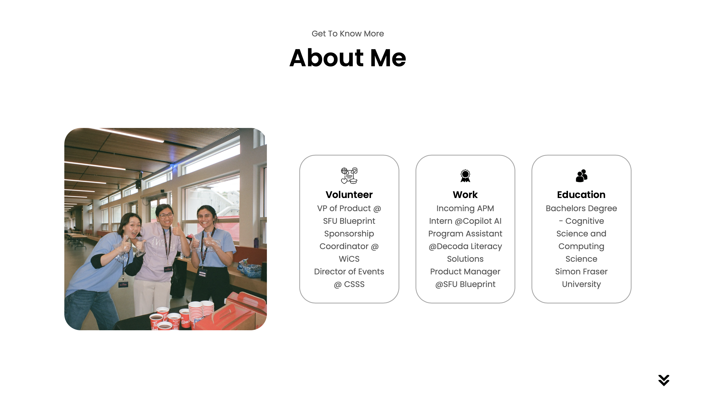

# Avni Kapoor's Portfolio

Welcome to the repository for my personal portfolio website. This site showcases my work, skills, and projects as a 3rd year COGS + CS student at SFU.

## Link

Visit <https://avkap007.github.io/portfoliowebsite/>

## Tech Stack

This portfolio is built with a focus on simplicity and performance, utilizing the following technologies:

- **HTML5**: For structuring the content and layout of the website.
- **CSS3**: For styling, visual effects, and responsive design. Includes `mediaqueries.css` for handling different screen sizes and devices.
- **JavaScript**: For dynamic interactions and functionalities, like the hamburger menu for mobile devices.
- **GitHub Pages**: Used for hosting the website, leveraging GitHub's servers for reliable uptime and fast content delivery.
- **And love <3**

The choice of technologies ensures that the website is lightweight and fast-loading, providing a seamless user experience across all devices.

## Wireframe

[wireframe_portfolio.pdf](wireframe_portfolio.pdf)

## Website Sections

- **About**: Learn more about me, my background, and my experiences in volunteer work, education, and professional roles.
- **Skills**: A comprehensive list of my skills in Product Management, Technical Skills, and Data Analysis.
- **Projects**: Explore some of my recent work, including a Book Recommender, Digital Journal, and CodeMentor AI, complete with links to live demos and GitHub repositories.
- **Contact**: Various ways to get in touch with me, including email, LinkedIn, and Instagram.

## Features

- Responsive navigation with a desktop and mobile-friendly hamburger menu.
- A dedicated section for a downloadable resume and direct contact information.
- Social links to LinkedIn and GitHub for professional networking.
- An interactive UI with direct links to my projects and skills.

Feel free to explore the site and get in touch if you have any questions or opportunities to discuss!

## License

This project is licensed under the [GNU General Public License v3.0](LICENSE).

->The GPL license was chosen for this project to ensure that all derivatives of this work will also be kept free and open-source. It aligns with the principle of ensuring that the freedoms to use, study, modify, and share software remain intact for all users.

---

Copyright &#169; 2023 Avni Kapoor. All Rights Reserved.
